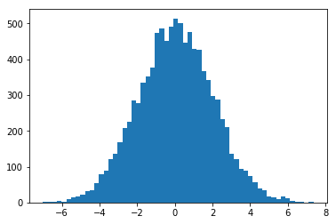

# Skewness and Kurtosis - Lab

## Introduction

In this lab, you'll calculate skewness and kurtosis for a given dataset in SciPy using Python.

## Objectives
You will be able to:
* Measure, visualize, and interpret the kurtosis of a dataset
* Measure, visualize, and interpret the skewness of a dataset

## Bring in SciPy
In the previous lesson, you have seen formulas to calculate skewness and kurtosis for your data. Scipy comes packaged with these functions and provides an easy way to calculate these two quantities, see [scipy.stats.kurtosis](https://docs.scipy.org/doc/scipy/reference/generated/scipy.stats.kurtosis.html#scipy.stats.kurtosis) and [scipy.stats.skew](https://docs.scipy.org/doc/scipy/reference/generated/scipy.stats.kurtosis.html#scipy.stats.skew). Check out the official SciPy documentation to dig deeper into this. Right now you can use: 
> `scipy.stats.kurtosis(x)`

> `scipy.stats.skew(x)`

Where $x$ is a random variable. 

You'll generate two datasets and measure/visualize and compare their skew and kurtosis in this lab.


```python
# Import required libraries
import numpy as np
import matplotlib.pyplot as plt

from scipy.stats import kurtosis, skew
```

## Take 1
* Generate a random normal variable `x_random` in numpy with 10,000 values. Set the mean value to 0 and standard deviation to 2.
* Plot a histogram for the data, set bins to `auto` (default). 
* Calculate the skewness and kurtosis for this data distribution using the SciPy functions.
* Record your observations about the calculated values and the shape of the data. 


```python
x_random = np.random.normal(0, 2, 10000)
plt.hist(x_random, bins='auto')
print ('Skewness =', skew(x_random))
print ('kurtosis =', kurtosis(x_random))
```

    Skewness = 0.006529088214677121
    kurtosis = -0.038154238156399956





```python
# Your observations here 

# Data is normally distributed (obviously) and thus symmetrical 

# A very slight negative skewness is observed as there are slightly more values on the right 
# side of distribution mean than those on left side

# The kurtosis value shows that this distribution is Platykurtic: (Kurtosis < 3)

# Data is light tailed, and has no outliers. 
```

## Take 2

Let's generate another distribution 


```python
x = np.linspace( -5, 5, 10000 )
y = 1./(np.sqrt(2.*np.pi)) * np.exp( -.5*(x)**2)
```

* Plot a histogram for data $y$, and set bins to auto (default).
* Calculate the skewness and kurtosis for this data distribution using the SciPy functions.
* Record your observations about the calculated values and the shape of the data.


```python
plt.hist(y, bins='auto')
print ('Skewness =', skew(y))
print ('kurtosis =', kurtosis(y))
```

    Skewness = 1.109511549276228
    kurtosis = -0.31039027765889804


```python
# Your observations here 

# A high positive skewness is observed as there are more values on the left 
# side of distribution mean than those on right side

# A negative kurtosis value indicates that the distribution has lighter tails 
# and a flatter peak than the normal distribution. Note that the measure of kurtosis is
# "comparing" to a normal distribution. Looking at the plot, the distribution is clesrly
# not normsl. kurtosis values are really mostly useful to look at when your observed curve 
# bell-shaped and you want to know if your tails are lighter or fatter than a normal distribution
```

## Summary

In this lesson we learned how to calculate, visualize and analyze the skewness and kurtosis for any given distribution. We worked with synthetic datasets at this stage to get the concepts cleared up. Later we shall try these techniques on real datasets to see if they are fit for analysis (or not). 
